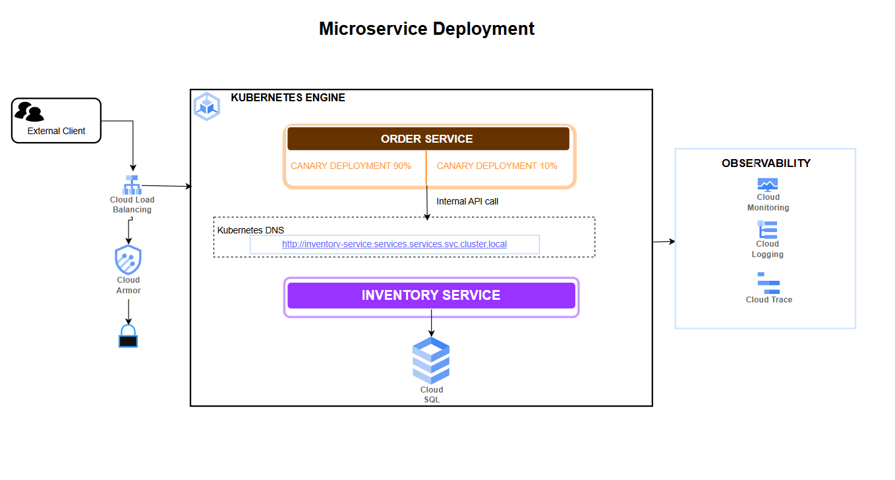

# DevOps Capstone Project — Order & Inventory Microservices on GKE

- This project deploys two backend microservices — an **Order Service** (Node.js/Express) and an **Inventory Service** (Python/FastAPI) — on Google Kubernetes Engine (GKE).
- Both services are containerised using Docker and deployed via Helm charts to a private GKE cluster.
- The CI/CD pipelines are automated using **Cloud Build**, which builds Docker images, pushes them to Artifact Registry, and deploys via Helm.
- Cloud infrastructure is fully provisioned using **Terraform**, covering networking, GKE, Cloud SQL, IAM, and observability.
- Both services share a **Cloud SQL (PostgreSQL 14)** instance over private IP, with credentials managed via Secret Manager.
- Traffic enters through a **GKE Gateway API** with Cloud Armor WAF and managed SSL; the Inventory Service is internal-only (ClusterIP).
- Full observability is set up with **GKE Managed Prometheus**, Cloud Monitoring dashboards, SLOs, log-based metrics, and Cloud Trace.

---

## Project Structure

```

|__ app
|   |__ Inventory Service
|   |__ Order Service 
├── README.md
│
├── infra/                          
│   ├── main.tf
│   ├── backend.tf
│   ├── variables.tf
│   ├── outputs.tf
│   └── modules/
│       ├── gke/                    
│       ├── networking/             
│       ├── cloudsql/               
│       ├── iam/                    
│       └── monitoring/             
│
├── charts/
│   ├── order-service/              
│   │   ├── Chart.yaml
│   │   ├── values.yaml
│   │   ├── values-dev.yaml
│   │   ├── values-staging.yaml
│   │   ├── values-prod.yaml
│   │   └── templates/              
│   │
│   └── inventory-service/          
│       ├── Chart.yaml
│       ├── values.yaml
│       ├── values-dev.yaml
│       ├── values-staging.yaml
│       ├── values-prod.yaml
│       └── templates/
│
├── k8s/                            
│   ├── gateway.yaml                
│   ├── httproute-order.yaml        
│   └── networkpolicy-global.yaml   
│
├── scripts/                        
│   ├── chaos_test.sh
│   ├── rotate_secret.sh
│   ├── canary_promote.sh
│   ├── test_internal_comm.sh
│   └── post_plan.sh
│
├── cloudbuild-order.yaml           
├── cloudbuild-inventory.yaml       
└── cloudbuild-iac.yaml             
```

---

## Project Architecture



### How the Services Communicate

- External clients send requests to `POST /orders` via the **Cloud Load Balancer → Cloud Armor WAF → GKE Gateway**.
- The **Order Service** receives the request, then calls the **Inventory Service** internally using Kubernetes DNS:
  `http://inventory-service.services.svc.cluster.local/inventory/check`
- The Inventory Service checks and deducts stock, then responds to the Order Service.
- The Order Service writes the confirmed order to **Cloud SQL** and returns the response.
- The Inventory Service is **ClusterIP only** — it is never exposed externally.

---

## Prerequisites

- **Terraform** 
- **kubectl** 
- **Helm** 
- **Docker** 
- **gcloud CLI** 
- **GCP Project** 
- Both repositories forked into your GitHub account and connected to Cloud Build

---

## Setup Instructions

### 1. Clone the Repository

```bash
git clone 
```

### 2. Enable Required GCP APIs

```bash
gcloud services enable \
  container.googleapis.com \
  sqladmin.googleapis.com \
  secretmanager.googleapis.com \
  artifactregistry.googleapis.com \
  cloudbuild.googleapis.com \
  monitoring.googleapis.com \
  logging.googleapis.com \
  cloudtrace.googleapis.com \
  compute.googleapis.com \
  servicenetworking.googleapis.com
```


## Terraform Commands

All Terraform commands must be run from the `infra/` directory.

### Initialise Terraform

```bash
cd infra/
terraform init
```

### Validate Configuration

```bash
terraform validate
```

### Plan Deployment

```bash
terraform plan 
```

### Apply Configuration

```bash
terraform apply 
```

### Destroy Infrastructure

```bash
terraform destroy
```

**Note:** Terraform state is stored remotely in a GCS bucket with versioning and object locking enabled.


---

## Helm Deployment

### Deploy Inventory Service

```bash
helm upgrade --install inventory-service charts/inventory-service \
  --namespace services \
  --values charts/inventory-service/values-prod.yaml \
  --set image.tag=<IMAGE_TAG> \
  --atomic --timeout 5m
```

### Deploy Order Service

```bash
helm upgrade --install order-service charts/order-service \
  --namespace services \
  --values charts/order-service/values-prod.yaml \
  --set image.tag=<IMAGE_TAG> \
  --atomic --timeout 5m
```

---

## Cloud Build CI/CD Pipelines

- **cloudbuild-order.yaml** — Order Service pipeline: install deps → unit tests → docker build → push to Artifact Registry → helm upgrade → canary promote → manual approval 
- **cloudbuild-inventory.yaml** — Inventory Service pipeline: install deps → unit tests → docker build → push to Artifact Registry → helm upgrade → manual approval 
- **cloudbuild-iac.yaml** — Terraform IaC pipeline: fmt check → validate → plan (saved to GCS) → post PR comment → manual approval → apply

---

## Bash Scripts

All scripts support a `--help` flag.

| Script | Purpose |
|---|---|
| `chaos_test.sh` | Kills a random pod, waits for recovery within 60s, verifies end-to-end order flow |
| `rotate_secret.sh` | Rotates Cloud SQL password in Secret Manager, triggers rolling restart of both deployments, verifies DB connectivity |
| `canary_promote.sh` | Waits 5 minutes, checks Cloud Monitoring error rate — promotes canary to 100% if < 1%, else rolls back |
| `test_internal_comm.sh` | Execs into an Order Service pod and curls the Inventory Service via Kubernetes DNS |
| `post_plan.sh` | Posts `terraform plan` output as a GitHub PR comment; fails pipeline if destroy count > 0 |

### Run the Internal Communication Test

```bash
./scripts/test_internal_comm.sh --namespace services
```

### Run the Chaos Test

```bash
./scripts/chaos_test.sh --namespace services
```

### Rotate the Database Secret

```bash
./scripts/rotate_secret.sh --secret-name cloudsql-order-password
```

---

## Security

- **Secret Manager CSI Driver** — database credentials are mounted into pods as volumes at runtime
- **Cloud Armor** — OWASP Top 10 WAF ruleset attached to the Order Service backend
- **NetworkPolicy** — Order Service can only reach Inventory Service on port 8080; Inventory Service blocks all traffic except from Order Service; both block internet egress except to Cloud SQL and Secret Manager
- **Pod Security Standards** — `restricted` profile enforced on the `services` namespace
- **Private GKE cluster** — nodes have no public IPs; outbound traffic goes through Cloud NAT

---

## Observability

- **GKE Managed Prometheus** scrapes `/metrics` from both services every 30 seconds via PodMonitoring CRDs
- **Cloud Monitoring Dashboard** — request rate, error rate (5xx), p99 latency, pod restart count, CPU & memory — one row per service
- **SLOs** for Order Service — availability ≥ 99.5% and request latency p99 ≤ 500 ms (28-day rolling window)
- **Log-based metrics** capture 5xx errors from both services in Cloud Logging
- **Alerting** — Slack webhook for WARNING (error rate > 2% for 5 min), Email for CRITICAL (SLO burn rate breach)
- **Cloud Trace** — both services instrumented with OpenTelemetry SDK; full Order → Inventory trace visible in GCP console

---

## Important Notes

- Always run Terraform commands from the `infra/` directory
- Store sensitive values in `terraform.tfvars` — this file is gitignored; never commit secrets
- Review `terraform plan` output before applying, especially for any resource deletions
- Keep `.terraform/` directory local — do not commit it
- Deploy Inventory Service before Order Service — Order Service depends on it being available
- The `services` namespace must exist and have Pod Security Standard labels applied before deploying Helm charts

---
